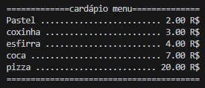

# Exercício cardápio:

O seguinte exercício consiste em uma breve atividade prática de fixação dos conceitos de manipulação de strings e dados

## Tópicos trabalhados:
* criação e manipulação de strings
* concatenação e interpolação de variáveis
* entrada e saída de dados: input( ) e print( )
* conversão de tipos de dados

## Descrição:
Utilizando os conceitos abordados acima você tem como objetivo construir um cardápio simples de restaurante. O cardápio em questão deve conter no mínimo 5 itens, sendo cada item composto por seu nome e preço, cada item assim como seu preço podem ser respresentados como uma string/valor atribuídas a um variável como no exemplo abaixo:

```Python
item="coxinha"
valor_item1=5
```

Abaixo encontra-se a sugestão de um modelo exemplo de cardápio:



Para construir o cardápio conforme o modelo sugerido fique a vontade para utilizar o seu método preferido de interpolação de veriáveis (.format( ), f-string, %, """), atente-se apenas ao fato de que cada item do cardápio possui seu nome separado do preço por pontos ".", e que o preço deve ser exibido com duas casa decimais seguido de "R$"

> [!TIP]
>Dicas úteis
> * utilize métodos como .Title( ) e .center( ) para simplificar a criação do modelo
> * utilize o tipo float para exibir os valores em formato decimal

## Desafio:
* Utilize o método input( ) para receber do usuário os dados (nome, preço) dos itens
