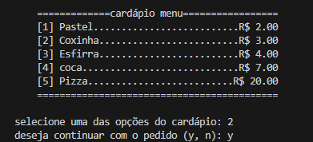
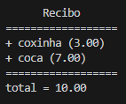

# Adicionando interatividade (cardápio):
Hoje nosso foco será tornar o cardápio funcional adicionando interatividade para com o usuario. 

Utilizando os conceitos hoje aprendidos em sala e a base de exibição do cardápio desenvolvido na aula anterior, seu objetivo será simular o funcionamento de um pedido, onde mediante entradas digitadas via terminal o usuário poderá escolher entre as opções de pratos do menu, assim como poderá visualizar uma listagem dos pratos selecionados, seus respecitvos preços e o valor total do pedido ao finalizá-lo.

Abaixo encontra-se um pequeno modelo para a listagem dos itens do pedido e input's para a seleção dos mesmos, sinta-se a vontade para modificá-los como deseja:

## Tópicos trabalhados:
- Esturuta de repetição while
- Estruturas condicionais (if, else e elif)
- Operações aritmétricas e lógicos
- Entrada e saída de dados

> [!TIP]
>Dicas úteis
> * Use um laço while True como base para o sistema de pedidos.
> * Utilize uma variável de controle para regitrar a finalização do pedido

## Desafio:

- Simule um cenário de pagamento coletivo, onde o usuário poderá informar a quantidade de pessoas que o acopanham no pedido e o sistema irá lhe retornar o valor a ser pago por cada pessoa individualmente. 

Ex: grupo de 4 amigos fazem pedido com valor de R$ 40,00, e selecionam a opção de pagamento coletivo, o sistema portanto deverá retorna 10 como valor a ser pago individualmente por todos.
