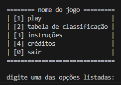

# Introdução ao desenvolvimento de jogos (menu inicial):

Daremos início ao estudo do desenvolvimento das composições de games através da reprodução de um dos seus elementos primordiais, o menu inicial, presente na vasta maioria dos games, desde o clássico Ultima até o mais recente call of duty, menus estão presentes nos jogos e são essenciais ao seu funcionamento.

Hoje seu objetivo será construir uma tela e estrutura de funcionamento de menu simples através dos conceitos aprendidos nas aulas anteriores. Como referência abaixo encontra-se um menu simples em linha de comando, sinta-se a vontade para modifica-lo e molda-lo ao seu jeito.

## Tópicos trabalhados:
- Criação e manipulação de strings
- Estruturas condicionais e de repetição