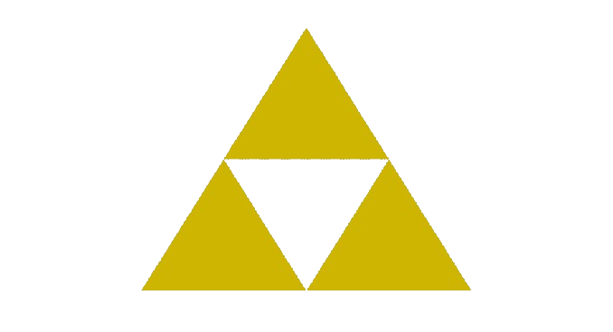

# Exercício DRAW:

Dando continuidade ao aprendizado de pygame hoje iremos praticar o uso das funções do módulo draw, utilizando os conceitos abordados em aula e com auxílio dos recursos de aprendizagem disponibilizados seu objetivo será reproduzir bandeiras da frança e do japão.

## Tópicos trabalhados
- criação do objeto tela (surface) com largura e altura personalizadas
- manipulação e criação de formas mediante chamadas de funções do módulo draw
- fluxo de execução do pygame

> [!TIP]
> * Utilize o método fill para preencher o background de uma superfície com uma cor sólida
> * Utilize [sites](https://www.rapidtables.com/web/color/RGB_Color.html) de seleção de cores rgb ou mesmo o próprio recurso nativo do vscode para facilitar o processo de escolha das mesmas

## Desafio:
Se você se sente confiante o suficiente, que tal tentar representar um dos artefatos fictícios mais famosos do mundo dos games? A triforce presente na franquia de jogos zelda. para isso você pode utilizar a função de polígnos também presente no módulo draw.

