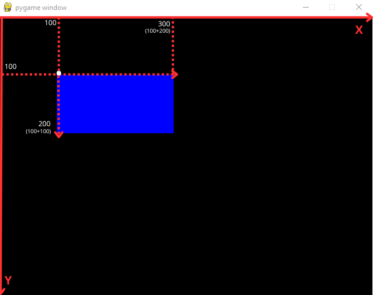

# Módulo DRAW

O draw é um módulo pertencente ao pacote pygame voltado a renderização de formas geométricas. Antes de adentrar propriamente dito nos detalhes de implementação relativos as funções disponilizadas, é necessário ter domínio de alguns conceitos matemáticos fundamentais tais quais:

## Coordeandas e plano cartesiano:

Um plano cartesiano é um sistema de coordenadas baseadas em eixos e quadrantes que nos permite localizar um ponto através de um par ordenado de números, onde o primeiro representa um valor horizontal delimitado com base no eixo x, e o segundo um valor vertical delimitado com base no eixo y (x, y). A origem do nosso plano parte do ponto (0,0), e cada quadrante configura-se em uma escala de números negativos e positivos para cada eixo:


O pygame se utiliza de uma variação do conceito de coordenadas em uma plano cartesiano tanto para posicionar, como para definir a largura e altura de uma forma. Imagine a tela que criamos anteriormente como uma grade quadriculada de pixels, onde ao contrário do conceito original nossa origem (0,0) parte do canto superior esquerdo, e nossos pontos de cada eixo crescem e aumentam a partir de sua origem para a direita e para baixo, é dessa forma que o plano cartesiano se manifesta no pygame e partir desse sistema é que podemos definir onde uma forma inicia e até onde prossegue por exemplo.


## Principais funções:

A seguir encontra-se uma listagem das principais formas suportadas pelo módulo draw:


### Retângulo:

parâmetros:
- objeto tela (surface) criado anteriormente onde nossa forma será exibida
- cor codificada em rgb (red, green, blue)
- tupla contendo respectivamente coordenada x, coordenada y, largura a partir de x e altura de y.

```python
pygame.draw.rect(tela, (0, 0, 255), (100, 100, 200, 100))
```



## Círculo

parâmetros:
- objeto tela (surface)
- cor codificada em rgb (red, green, blue)
- tupla contendo respectivamente posição do centro do círculo em relação ao eixo x, centro do circulo em relação a y e raio.


```python
pygame.draw.circle(tela, (0,0,255), (400, 200), 100)
```


## Linha

parâmetros:
- objeto tela (surface) 
- cor codificada em rgb (red, green, blue)
- tupla contendo respectivamente coordenada de início da linha (x,y), coordenada do fim da linha (x,y) e espessura da linha.

```python
pygame.draw.line(tela, (0, 0, 255), (100, 200), (550, 200), 5)
```


## polígno (triângulo)

parâmetros:
- objeto tela (surface) 
- cor codificada em rgb (red, green, blue)
- tupla contendo respectivamente coordenada (x,y) para o primeiro, segundo e terceiro vértices.

```python
pygame.draw.polygon(tela, (255, 255, 0), ((150, 350), (225, 250), (300,350)))
```


## Elipse

parâmetros:
- objeto tela (surface) 
- cor codificada em rgb (red, green, blue)
- tupla contendo respectivamente a posição do início do retângulo (não exibido) que irá circundar nossa elipse, e sua largura e altura. 

```python
pygame.draw.ellipse(tela, (0, 0, 255), (100, 100, 300, 200), 3)
```


## Arco

parâmetros:
- objeto tela (surface) 
- cor em rgb (red, green, blue)
- tupla contendo respectivamente a posição do início do retângulo (não exibido) que irá circundar nossa arco, e sua largura e altura.
- ângulo em radiando referente ao ínicio do arco
- ângulo em radiando referente ao fim do arco
- espessura do arco

```python
pygame.draw.arc(tela, (255,0,0), (100, 240, 200, 200), 0, pi, 3)
```

